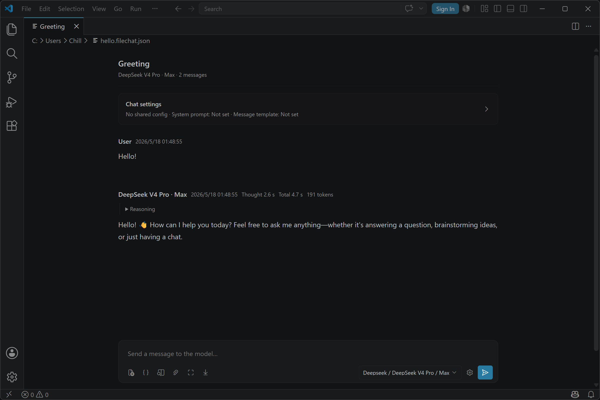
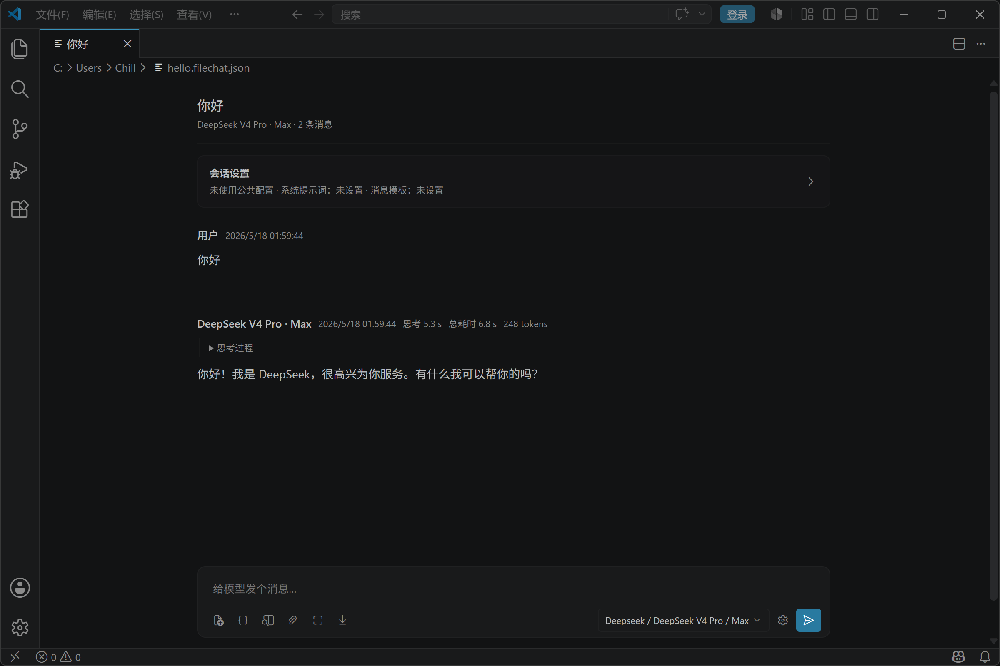

# One File Chat

## English

One File Chat is a VS Code extension that stores each conversation as a plain `.filechat.json` file.

Instead of hiding chat history inside a private database, it keeps conversations in your workspace so they can be versioned, copied, branched, reviewed, and shared like any other project file.

### Screenshot



### Highlights

- One file per conversation, opened with a custom editor inside VS Code
- Conversations are saved directly to disk instead of a hidden app database
- Explorer sidebar shows chat sessions sorted by recent activity
- Retry and rewrite create new branches instead of overwriting existing history
- Per-message version history with preview, restore, copy, and delete actions
- Markdown rendering with LaTeX math support via `$...$` and `$$...$$`
- Image and file attachments through picker, paste, drag and drop, or local Markdown links
- Session-level model selection, common config, system prompt, and message template

### Who It's For

One File Chat is built for people who want AI conversations to behave like project artifacts.

- Keep prompt history next to code, docs, and assets
- Track conversations with Git
- Preserve alternate branches of a discussion
- Use your own OpenAI-compatible provider instead of a locked-in hosted chat UI

### Quick Start

1. Install the extension.
2. Create `.filechat/key.json` in one of these locations: the chat file's directory, the workspace root, or your home directory.
3. Run the command `One File Chat: New Chat File`.
4. Open the generated `.filechat.json` file and start chatting.

Configuration is resolved in this order:

1. Chat file directory
2. Workspace root
3. User home directory

### key.json Example

```json
{
  "providers": {
    "openai": {
      "label": "OpenAI",
      "transport": "openai-compatible",
      "api_key": "${env:OPENAI_API_KEY}",
      "api_base": "https://api.openai.com/v1",
      "models": [
        {
          "id": "gpt-4.1-mini",
          "label": "GPT-4.1 Mini"
        },
        {
          "id": "gpt-5.4",
          "label": "GPT-5.4",
          "options": [
            {
              "id": "high",
              "label": "High",
              "config": {
                "reasoning_effort": "high"
              }
            }
          ]
        }
      ]
    }
  }
}
```

Notes:

- `openai-compatible` is currently the supported transport
- `api_key` and `api_base` support `${env:NAME}` expansion
- Model selection is saved back to the chat file so sessions can resume with the same setup

### Common Commands

- `One File Chat: New Chat File`
- `One File Chat: Manage Chat Config`
- `One File Chat: Manage Common Config`
- `One File Chat: Refresh Sessions`

### Attachments And Storage

- Attachments are stored under `.filechat/assets/` next to the chat file
- Supported image types: `png`, `jpg`, `jpeg`, `webp`, `gif`
- There is no fixed per-message attachment count limit; practical limits depend on the selected model, provider API, and runtime environment
- Non-image attachments are sent as file metadata by default instead of inlining the full file body into the prompt

### Common Configs

You can define reusable session presets in `.filechat/common_configs.json`, including shared system prompts and message templates. The session config panel in the chat view lets you inspect, switch, and save those values per conversation.

### Current Scope

- Built around OpenAI-compatible APIs, including compatible gateways such as LiteLLM Proxy
- Chat file format continues to evolve, with compatibility prioritized for existing data
- Assistant-generated Markdown images are best-effort persisted as local assets

### Development

```bash
npm install
npm run compile
```

Press `F5` in VS Code to launch an Extension Development Host.

### License

MIT

## 中文

One File Chat 是一个把每段对话直接保存成 `.filechat.json` 文件的 VS Code 扩展。

它不会把聊天历史藏进私有数据库，而是把会话留在你的工作区里，让它们像普通项目文件一样可版本管理、可复制、可分支、可审阅、可共享。

### 截图



### 亮点

- 一文件一会话：每个 `.filechat.json` 文件都会直接用 VS Code 自定义编辑器打开
- 会话直接落盘：聊天内容保存到磁盘，而不是隐藏在应用私有数据库里
- 会话列表：Explorer 侧边栏会按最近更新时间展示聊天文件
- 分支而不是覆盖：重试和改写会生成新分支，不会覆盖已有历史
- 单消息版本历史：支持预览、恢复、复制和删除历史版本
- Markdown 与数学公式：支持 Markdown 渲染，以及 `$...$` 和 `$$...$$` LaTeX 数学公式
- 图片与文件附件：支持文件选择、粘贴、拖拽，以及本地 Markdown 链接吸收
- 会话级配置：每个聊天都可以单独设置模型选择、通用配置、system prompt 和 message template

### 适合谁

One File Chat 适合想把 AI 对话当成项目资产来管理的人。

- 想把提示词历史和代码、文档、资源放在一起管理
- 想让聊天记录参与 Git、备份和协作
- 需要保留同一轮对话的多个分支和重试结果
- 想使用自己的 OpenAI-compatible 服务，而不是绑定单一聊天客户端

### 快速开始

1. 安装扩展。
2. 在以下任意位置创建 `.filechat/key.json`：聊天文件所在目录、工作区根目录，或用户 HOME 目录。
3. 运行命令 `One File Chat: New Chat File`。
4. 打开生成的 `.filechat.json` 文件并开始聊天。

配置查找顺序如下：

1. 聊天文件所在目录
2. 工作区根目录
3. 用户 HOME 目录

### key.json 示例

```json
{
  "providers": {
    "openai": {
      "label": "OpenAI",
      "transport": "openai-compatible",
      "api_key": "${env:OPENAI_API_KEY}",
      "api_base": "https://api.openai.com/v1",
      "models": [
        {
          "id": "gpt-4.1-mini",
          "label": "GPT-4.1 Mini"
        },
        {
          "id": "gpt-5.4",
          "label": "GPT-5.4",
          "options": [
            {
              "id": "high",
              "label": "High",
              "config": {
                "reasoning_effort": "high"
              }
            }
          ]
        }
      ]
    }
  }
}
```

说明：

- 当前支持的 transport 是 `openai-compatible`
- `api_key` 和 `api_base` 支持 `${env:NAME}` 环境变量展开
- 模型选择会写回聊天文件，便于下次恢复同一会话设置

### 常用命令

- `One File Chat: New Chat File`
- `One File Chat: Manage Chat Config`
- `One File Chat: Manage Common Config`
- `One File Chat: Refresh Sessions`

### 附件与存储

- 附件会保存在聊天文件同目录下的 `.filechat/assets/`
- 支持的图片类型：`png`、`jpg`、`jpeg`、`webp`、`gif`
- 单条消息的附件数量不设固定上限，实际可用范围取决于所选模型、提供方接口与运行环境
- 非图片附件默认只向模型发送文件元信息，不会把整份文件正文直接内联进 prompt

### 通用配置

你可以在 `.filechat/common_configs.json` 里定义可复用的会话预设，例如共享的 system prompt 和 message template。聊天页里的会话配置面板可以直接查看、切换和保存这些设置。

### 当前范围

- 当前主要围绕 OpenAI-compatible API，也支持 LiteLLM Proxy 这类兼容网关
- 聊天文件格式会继续演进，但优先保证已有数据可读
- 助手返回的 Markdown 图片会尽量落盘为本地资源

### 开发

```bash
npm install
npm run compile
```

在 VS Code 中按 `F5` 启动 Extension Development Host。

### License

MIT
